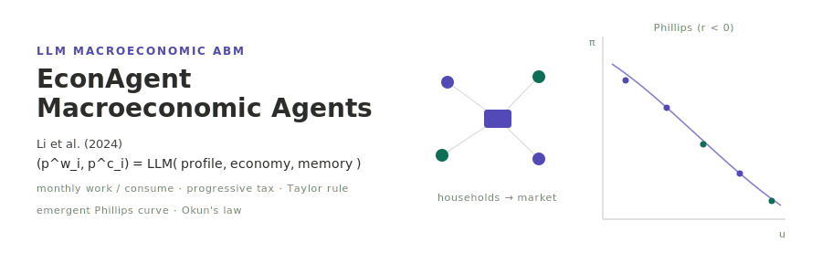

<p align="center"></p>

**English** | [日本語](README.ja.md)

# EconAgent: LLM-Empowered Agents for Simulating Macroeconomic Activities — Li et al. (2024)

A reimplementation of the LLM-driven macroeconomic agent-based model of Li et al. (2024), "EconAgent: Large Language Model-Empowered Agents for Simulating Macroeconomic Activities" (*ACL 2024*, 15523–15536; arXiv:2310.10436). A population of LLM-driven households each month makes two decisions — a *willingness to work* `p^w_i` and a *fraction of wealth to consume* `p^c_i` — based on a perception prompt fusing the agent's profile, the current macro variables, and its memory. These individual choices flow through a labour/goods market (production, demand, wage and price adjustment), a progressive tax with equal redistribution, and a Taylor-rule interest-rate policy. The paper's headline finding is that classical macro regularities — inflation, unemployment, the **Phillips curve** and **Okun's law** — *emerge from the bottom up* out of nothing but LLM semantic decisions, without hand-tuned rules or trained networks. The deterministic [socsim](https://github.com/akitenkrad/rs-social-simulation-tools) core handles household initialisation, the employment Bernoulli draws, the market-adjustment uniforms, scheduling and metrics, while the non-deterministic LLM layer is confined to the decision/reflection mechanisms and pseudo-determinised via the `socsim-llm` crate (prompt→response cache + `temperature=0` + fixed seed).

## Two-layer determinism (read this first)

LLM output is **outside** socsim's bit-reproducibility. The design therefore splits into two layers:

- **Deterministic socsim core** — household initialisation (Pareto wages, age distribution), employment Bernoulli draws, market-adjustment uniforms (`ctx.rng`, ChaCha20), scheduling, the fiscal/monetary accounting and all metrics. Given a seed this reproduces bit-for-bit.
- **Non-deterministic LLM layer** — the monthly work/consume decision and the quarterly reflection. Pseudo-determinised by `socsim-llm`'s `CachingClient` (a `hash(prompt+model)` → response cache), `temperature=0` and a fixed seed. The provider order is **Ollama first → OpenAI fallback** via `socsim-llm`'s `FallbackClient`.

The cache — not the model — is the reproducibility mechanism: a warm cache replays identical responses, so a rerun is free and stable (the paper notes one simulation cost ~$30 and ~2 hours). Each run writes `run_metadata.json` recording the model, endpoint, temperature, seed and cache-hit rate. Because the local default model (`llama3.2`) differs from the paper's `gpt-3.5-turbo`, reproduction targets are **qualitative**: a negative Phillips correlation (`r < 0`), a negative Okun correlation (`r < 0`), and inflation/unemployment in plausible ranges — not the exact `r = −0.619` / `r = −0.918`.

> This project standardises on the `socsim-llm` crate for the LLM layer; it does **not** use `reqwest` (socsim-llm owns the HTTP transport). It needs no spatial grid or network (`socsim-grid` / `socsim-net`): the interaction is market-mediated, so it depends only on `socsim-core` + `socsim-engine` + `socsim-llm`.

## Install & Quick start

```bash
# Build the Rust simulation (fetches socsim incl. socsim-llm with the Ollama+OpenAI backends)
cargo build --release

# Make sure a local Ollama is running and a model is pulled, e.g.:
#   ollama pull llama3.2:latest
export OLLAMA_HOST=http://localhost:11434
export OLLAMA_MODEL=llama3.2:latest
# Optional OpenAI fallback:
#   export OPENAI_API_KEY=sk-...   OPENAI_MODEL=gpt-4o-mini

# Run a small simulation (a quick smoke; the paper uses N=100, months=240)
cargo run --release -- run --n-agents 4 --months 12 --seed 42

# Install the Python visualization tools (at the workspace root)
uv sync

# Visualize the most recent run (macro time series + Phillips/Okun scatter with Pearson r/p)
uv run econagent-tools visualize

# Inspect the run's settings and LLM metadata
uv run econagent-tools show-experiment-settings --results-dir results/latest
```

### Offline (no-LLM) smoke

The full month loop, output writers and Python visualization can be exercised without any live LLM via a scripted mock client:

```bash
cargo run --release --example mock_smoke -- results
uv run econagent-tools visualize
```

## Scope

This repository currently implements **Phase 1** (the `EconWorld` + five mechanisms over the six-phase loop, the LLM decision layer with Ollama→OpenAI fallback + caching, the `run` subcommand, and the macro metrics) and **Phase 2** (the `sweep` over agent count × tax-scale × LLM model, plus the Python `visualize` / `visualize-sweep` / `show-experiment-settings` tools, including the Phillips-curve and Okun's-law scatter with scipy Pearson `r`/`p`). The one-shot paper reproduction (`reproduce`, Fig. 2–6 / Table batch) and the COVID-19 external-intervention prompt are left as future work (Phase 3); clean extension points are kept throughout.

## Documentation

- [Use cases](docs/usecases.md) — what you can do with this project, with pointers to the rest of the docs.
- [CLI](docs/cli.md) — the Rust CLI: the `run` and `sweep` subcommands and their flags, plus the LLM environment variables.
- [Visualization](docs/visualization.md) — the Python `econagent-tools` and how to interpret the outputs (incl. Phillips/Okun).
- [Architecture](docs/architecture.md) — repository structure, the two-layer determinism, the socsim/`socsim-llm` framework, the mechanisms, the metrics, and references.

## License

MIT

---
*This file was generated by Claude Code.*
